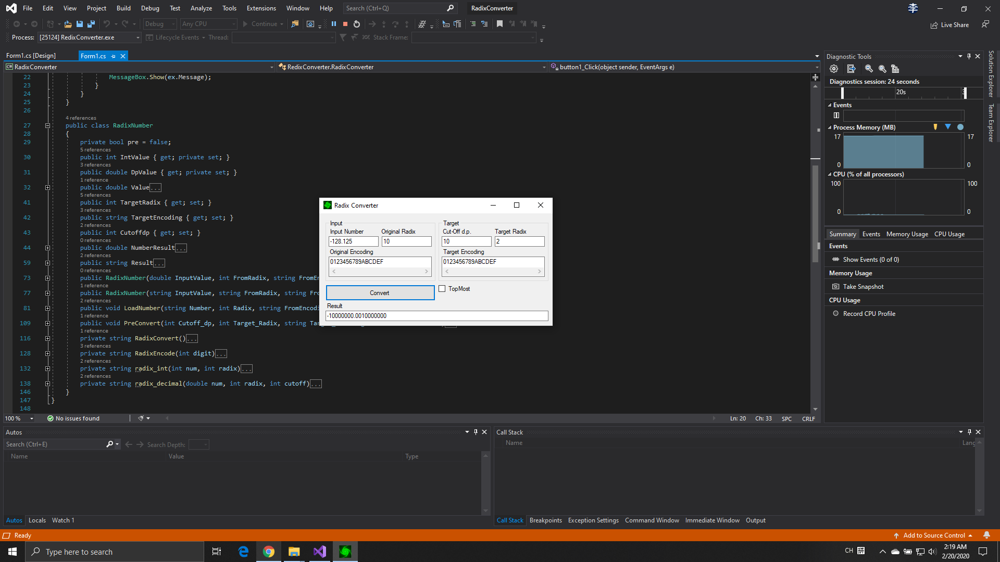

# RadixConverter

- Convertion between different radix
- Supports non-integers! For example, it can convert 2e.3a4d or 10.01110101 to other radix
- Supports customized mappings! For example, you can encrypt 1234 to BYFE or ЛШПЗ

## UI

